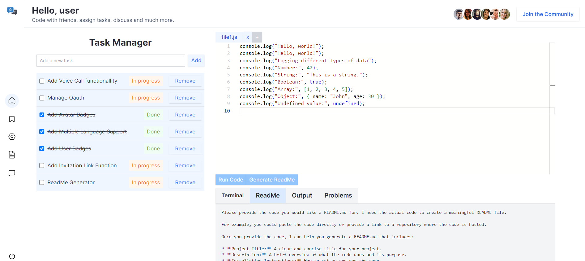

# SaathCode

SaathCode is a cutting-edge collaborative runtime code editor designed to facilitate real-time collaboration between developers. Built using the powerful combination of Next.js, Prisma, MongoDB, TypeScript, and Tailwind CSS, SaathCode offers a versatile platform with support for multiple programming languages, including JavaScript and Python. This project integrates various features, such as OAuth authentication, terminal access, and a Gemini-based README generator, ensuring a seamless and productive coding experience. Future updates will include voice call functionality and an advanced task management UI for marking tasks as done or in-progress.

## Project Overview

SaathCode aims to revolutionize the way developers collaborate by providing a platform that supports real-time coding sessions, complete with language support for JavaScript, Python, and more. Whether you’re working on a group project, conducting a code review, or simply pair programming, SaathCode offers all the tools you need to be productive and efficient.

## Features

### Real-time Collaboration

- **Shared Editing:** Multiple users can edit the same document simultaneously, with changes reflected in real-time.
- **Cursor Tracking:** See where other collaborators are working in the document.

### Multiple Language Support

- **JavaScript:** Write and execute JavaScript code directly within the editor.
- **Python:** Support for Python scripting and execution.
- **More Languages:** Easily extendable to support additional languages as needed.

### Authentication

- **Secure OAuth Sign-Up and Sign-In:** Users can securely authenticate using popular OAuth providers, ensuring secure access to the platform.

### Terminal and Output Window

- **Integrated Terminal:** Execute commands and interact with the server directly from the editor.
- **Output Window:** View the results of your code execution without leaving the interface.

### Gemini-based README Generator

- **Automatic README Generation:** Generate project README files dynamically using the Gemini platform, saving time and ensuring consistency.

### Task Management UI

- **Task Creation:** Easily create and manage tasks associated with your projects.
- **Progress Tracking:** Mark tasks as done or in-progress with a user-friendly interface.

### Future Feature - Voice Call Integration

- **Real-time Communication:** Future integration of voice calling to facilitate communication during collaboration sessions.

## Tech Stack

### Frontend

### Backend

### Authentication

### Collaboration Tools

### Other Tools

## Screenshot

